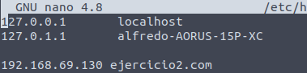

# Ejercicio 3

- [Ejercicio 3](#ejercicio-3)
  - [Comprobaciones iniciales](#comprobaciones-iniciales)
  - [Creación del virtualhost](#creación-del-virtualhost)
    - [Creación de carpetas y permisos](#creación-de-carpetas-y-permisos)
    - [Creación de la web](#creación-de-la-web)
    - [Creación de los archivos del Virtual Host](#creación-de-los-archivos-del-virtual-host)
    - [Habilitar los archivos](#habilitar-los-archivos)
    - [Configuración de Hosts](#configuración-de-hosts)
  - [Resultado final](#resultado-final)

## Comprobaciones iniciales

Primero vamos a comprobar que Apache2 esté en funcionamiento con el siguiente comando:

>ufw status

Si nos aparece en estado inactivo tendremos que activarlo con el siguiente comando:

>ufw enable

Una vez ejecutado el anterior comando veremos que ya se ha activado con lo que utilizaremos el siguiente comando para comprobar las aplicaciones disponibles.

>ufw app list

Después comprobaremos que apache esté funcionando es los puertos 80,443/tcp con el siguiente comando:

>ufw app info "Apache Full"

Nos debera aparecer algo asi:

En el caso de que no estubiesen habilitados utilizariamos:

>ufw allow "Apache Full"

## Creación del virtualhost

### Creación de carpetas y permisos

Para empezar nos crearemos mediante comando nuestra carpeta donde va a estar almazenada la web.

>sudo mkdir -p /var/www/ejercicio3.daw/public_html

Seguidamente, le daremos permisos a esta carpeta con:

>sudo chown -R $USER:$USER /var/www/ejercicio3.daw/public_html

También deberemos asegurarnos que tenga permisos de lectura, se los asignaremos con:

>sudo chmod -R 755 /var/www

### Creación de la web

Una vez todo lo anterior realizado con exito deberemos crear en la ruta de nustra web un documento html con el siguiente comando.

>nano /var/www/ejercicio3.daw/public_html/index.html

Una vez ejecutado el comando anterior podremos editar a nuestro gusto la página html.

Una vez terminemos de editarla la guardamos y continuamos.

### Creación de los archivos del Virtual Host

Para comenzar deberemos ejecutar los dos siguientes comandos para crear los archivos de configuración de la página.

>sudo cp /etc/apache2/sites-available/000-default.conf 

>/etc/apache2/sites-available/ejercicio3.daw.conf

Una vez ejecutados los anteriores comandos deberemos editar estos archivos usando:

>sudo nano /etc/apache2/sites-available/ejercicio3.conf

Una vez hayamos accedido al archivo deberemos de modificarlo añadidendo las siguientes tres lines:

>ServerName ejercicio3.daw

>ServerAlias www.ejercicio3.daw

>DocumentRoot /var/www/ejercicio3.daw/public_html

Tal que asi:

Una vez tengamos estas líneas añadidas guardaremos el archivo.

### Habilitar los archivos

Una vez lleguemos aqui tendremos que habilitar los archivos creados y modificados anteriormente para poder usarlos en el servidor.

>sudo a2ensite eejercicio3.daw.conf

Después deshabilitaremos la página por defecto con el siguiente comando

>sudo a2dissite 000-default.conf

Y por ultimo reiniciaremos el servidor apache2 con:

>sudo systemctl restart apache2

### Configuración de Hosts

Para poder visualizar la pagina creada puede ser neseracio incluir nuestra dirección IP junto a la de nuestra web en el archivo hosts dentro de la carpeta etc.

Para modificar este archivo utilizaremos el siguiente comando.

>sudo nano /etc/hosts

Una vez dentro solo tendremos que añadir nuestra IP y la web. 

Ejemplo:

>111.111.111.111 ejercicio3.daw

## Resultado final

Una vez hemos terminado si introducimos la url de la página si todo funciona correctamente nos aparecera tal que asi:

